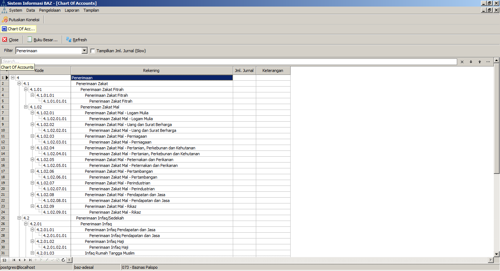
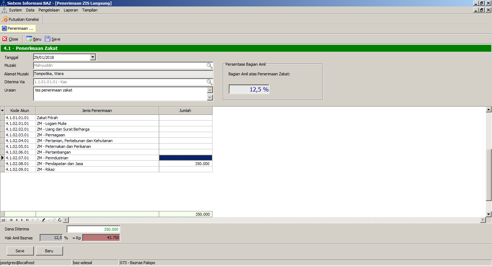
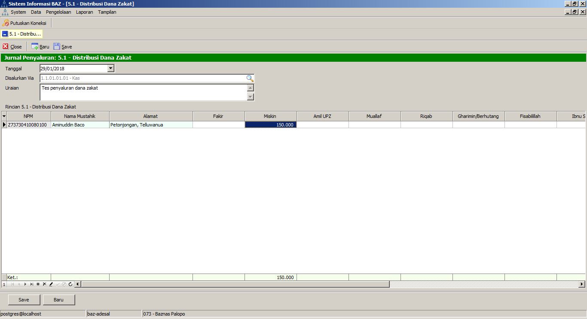
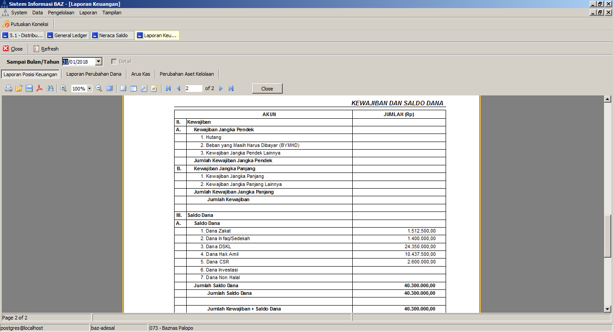

# bazda-delphi-xe8
Software Pengelolaan Zakat Untuk Baznas Daerah

# Latar Belakang
Pengelolaan pengumpulan dan pendistribusian zakat di Indonesia telah diatur dalam peraturan pemerintah dan peraturan kementerian serta diatur secara teknis dalam standar akuntansi, yang karenanya, informasi dan data yang diperoleh dapat lebih mudah dilaporkan dan diolah lebih lanjut. Data-data wajib zakat yang ada dapat diatur sehingga memudahkan pekerjaan pengelola zakat, dalam hal ini Badan Amil Zakat, untuk mencatat penerimaan zakat dan melaporkannya. Di sisi pendistribusian, penyaluran zakat ke penerima perorangan sesuai asnab yang ditentukan maupun dalam bentuk program-program sosial dapat dicatat lebih mudah dan rinci. Dari keseluruhan proses, laporan-laporan yang ditetapkan pun dapat lebih mudah diterbitkan dengan format yang standar dan mudah dipahami.

Keuntungan dan manfaat yang didapat di atas dapat menjadi sulit terpenuhi, jika sistem pencatatan masih manual, di mana pencatatan informasi dan pencarian data serta pelaporan masih dilakukan oleh manusia. Ini menjadi penyebab kelambatan pelayanan, keruwetan pencatatan, kelambatan pelaporan dan rentan terjadi kesalahan karena human error.

Dengan demikian diharapkan bahwa software Sistem Informasi Manajemen Badan Amil Zakat dapat menjadi bagian dari solusi: pendataan wajib zakat (muzakki) dan penyetor infaq, shadaqah dan sumber penerimaan lain, pencatatan rinci dan rekap yang mudah ditelusuri dan dicari, penerimaan dan penyaluran yang terkategorisasi, penerbitan laporan yang lebih mudah dan cepat, serta keseluruhan pekerjaan yang lebih ringkas. 

# Software
Software Sistem Informasi Manajemen Badan Amil Zakat mencakup fungsi-fungsi berikut:
1.	Pengaturan dan referensi
*	Pengaturan data kode akun sesuai standar yang berlaku
*	Pengaturan data user pengguna dan hak aksesnya
*	Pengelompokan jenis transaksi
*	Pengelompokan jenis penerimaan dan penyaluran
2.	Akuntansi
*	Pencatatan transaksi penerimaan dan penyaluran zakat secara tunai dan bank
*	Pencatatan Jurnal Umum
*	General Ledger
3.	Modul-Modul Operasional
*	Modul Pendataan Muzakki
*	Modul Pendataan Masjid Pengumpul Zakat
*	Penerbitan kwitansi penyetoran dan penyaluran zakat
4.	Pelaporan
*	Laporan Posisi Keuangan
*	Laporan Sumber dan Penggunaan Dana
*	Arus Kas
5.	Utilitas
*	Pengaturan koneksi database, 
*	backup-restore data

# Screenshots

# Hardware yang Dibutuhkan

Hardware yang diperlukan merupakan perangkat pendukung Software Sistem Informasi Manajemen Badan Amil Zakat, yang terdiri dari:
## Server. 
Merupakan sebuah komputer desktop (PC) dengan spesifikasi yang sedikit di atas rata-rata karena harus menjamin proses yang cepat tanpa masalah – mengingat bahwa fungsi server ini adalah induk dari transaksi-transaksi dalam lingkup Badan Amil Zakat.
Spesifikasi minimal server:
*	Prosesor Intel Core I3 2.0 Ghz atau sekelasnya
*	RAM 4GB DDR3
*	Mainboard yang sesuai
*	Monitor  dengan resolusi minimal 1024 x 768 atau 1366 x 768.
*	Harddisk SATA 250GB 7200 RPM
Hardware yang dibutuhkan sepenuhnya kami serahkan penyediaannya kepada pihak Badan Amil Zakat, dengan tetap menyesuaikan pada referensi yang kami cantumkan di atas demi melancarkan kinerja Software Sistem Informasi Manajemen Badan Amil Zakat.
## Client. 
Spesifikasi minimal server:
*	PC atau Laptop, RAM 2GB, Windows 7, Intel Dual Core atau Setara, HDD Kosong 1GB, Keyboard dan Mouse
*	Konektivitas LAN, baik cable-based maupun wireless.
## Kelengkapan Lainnya
*	Kelengkapan berupa casing tower dilengkapi kipas, USB outlet dan VGA outlet, power supply 500 W, keyboard dan mouse
*	UPS dengan stabilizer  kapasitas 1000 W – opsional, untuk menjaga server tetap aman saat terjadi gagal listrik
*	Printer untuk mencetak dokumen-dokumen  dan laporan-laporan.
*	LAN (Local Area Network) yang dapat berupa cable-based atau wireless (tanpa kabel). 
*	Instalasi hardware, dengan memperhatikan posisi wireless access point (WAP) atau LAN hub agar dapat memberikan akses optimal ke semua operator.

# Kompilasi

## Compiler dan IDE

Software SIMBAZ ini dicompile menggunakan Embarcadero Delphi XE8 32bit pada Windows 7 Home Basic 32bit. Compilasi dengan IDE lain tidak dianjurkan. Kompilasi dengan Delphi versi sebelum dan setelah XE8 belum diuji-coba, demikian pula kompilasi pada OS Windows selain Windows 7 32 bit. Executable hasil kompilasi telah diuji-jalankan pada Windows 7 32bit/64bit, Windows 8 dan Windows 10 secara normal.

## Dependencies

Software tambahan dan 3rd party component:
- Devart Unidac v.6.1.3 for RAD Studio XE8
- TMS Componenct Pack v.8.0.0
- EhLib 9.0 Build 9.0.033
- TPersen 1.0.0 [Git it here](https://github.com/AndanTeknomedia/TPersen)
- Jedi VCL v.349 Complete with JCL v.27-Build 5676
- MiTec MDIButtonGroup
- FastReport 5.4.7

## Notes

Pada source code project dan Stored Procedure, beberapa kode akun (dari Chart Of Accounts/COA) telah di-hard-coded demi menjaga aplikasi tetap simple tanpa terlalu banyak form konfigurasi untuk membuatnya dinamis. Anda mungkin perlu merevisi kode-kode ini jika terjadi perubahan struktur akun pada COA.

# Database Server

Database server menggunakan PostgreSQL 8.4 dengan *akses superuser (postgres)*. 
Akses superuser diperlukan untuk membuat custom domain.